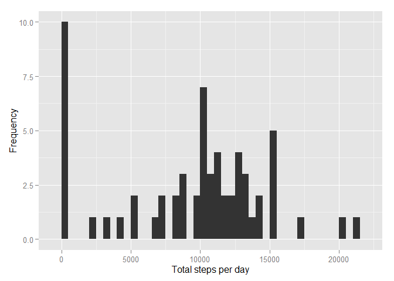
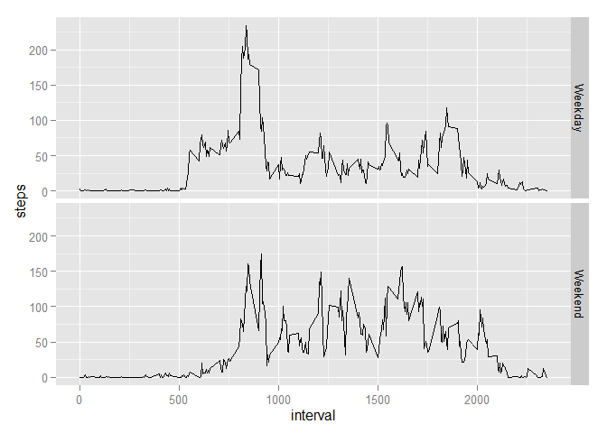

# Reproducible Research: Peer Assessment 1


## Loading and preprocessing the data
First, we load the required packages for downloading, processing and analysing the data.


```r
library(knitr)
library(downloader)
library(lubridate)
library(ggplot2)
library(randomForest)
```

```
## randomForest 4.6-12
## Type rfNews() to see new features/changes/bug fixes.
```

We download the data, unzip using the "downloader" R package and read the CSV file into a data frame called "Activity".


```r
url <- ("https://d396qusza40orc.cloudfront.net/repdata%2Fdata%2Factivity.zip")
download(url, dest="dataset.zip", mode="wb") 
unzip ("dataset.zip")
Activity <- read.csv("./activity.csv")
```

We look at the data characteristics and convert the date variable to the correct format.

```r
str(Activity)
```

```
## 'data.frame':	17568 obs. of  3 variables:
##  $ steps   : int  NA NA NA NA NA NA NA NA NA NA ...
##  $ date    : Factor w/ 61 levels "2012-10-01","2012-10-02",..: 1 1 1 1 1 1 1 1 1 1 ...
##  $ interval: int  0 5 10 15 20 25 30 35 40 45 ...
```

```r
Activity$date <- ymd(Activity$date)
```

## What is mean total number of steps taken per day?

We create a new variable which examines the sum of steps taken per day. Then we draw a histogram of the total steps each day.


```r
Sumsteps <- sapply(split(Activity$steps, Activity$date), sum, na.rm=TRUE)
qplot(Sumsteps, xlab='Total steps per day', ylab='Frequency', binwidth=500)
```

 

Finally we calculate and report the mean and median total number of steps per day.

```r
mean(Sumsteps) ; median(Sumsteps)
```

```
## [1] 9354.23
```

```
## [1] 10395
```

## What is the average daily activity pattern?

We can plot the average daily activity pattern by aggregating the data and creating a time series plot.

```r
dailypat <- aggregate(steps ~ interval, Activity, mean)
ggplot(dailypat, aes(x=interval, y=steps)) + geom_line()
```

 

The which.max() function is used to identify the 5-minute interval with the maximum number of steps.

```r
dailypat$interval[which.max(dailypat$steps)]
```

```
## [1] 835
```

## Imputing missing values
First we report on the total number of missing values in the dataset.

```r
sum(is.na(Activity))
```

```
## [1] 2304
```

Then we create a new dataset with no NAs. The na.roughfix() function in the randomForest package uses column medians as a strategy to replace NAs for numeric variables.

```r
Activity2 <- Activity
Activity2$steps <- na.roughfix(Activity2$steps)
```

Using the new dataset, we draw a histogram of the total number of steps taken each day.

```r
Sumsteps2 <- sapply(split(Activity2$steps, Activity2$date), sum)
qplot(Sumsteps2, xlab='Total steps per day', ylab='Frequency', binwidth=500)
```

 

Then we calculate the mean and median steps per day and compare the figures to the complete dataset. The values do not differ from the earlier estimates and thus, we can conclude that imputing missing data had no impact.

```r
mean(Sumsteps2) ; median(Sumsteps2)
```

```
## [1] 9354.23
```

```
## [1] 10395
```

```r
sum(mean(Sumsteps2) - mean(Sumsteps), median(Sumsteps2) - median(Sumsteps2))
```

```
## [1] 0
```

## Are there differences in activity patterns between weekdays and weekends?
To address the question, we create a new factor variable indicating weekend or weekday.

```r
Activity$dtype <- ifelse(wday(Activity$date) %in% c(1,7), "Weekend", "Weekday")
```

Then we draw a panel plot comparing weekdays with weekend days.

```r
pdata <- aggregate(steps ~ interval + dtype, Activity, mean)
g <- ggplot(pdata, aes(x=interval, y=steps))
g + geom_line() + facet_grid(dtype ~ .)
```

 

Comparison of the plots indicates that on weekends, activity levels are lower than on weekdays when the number of steps taken is higher.


